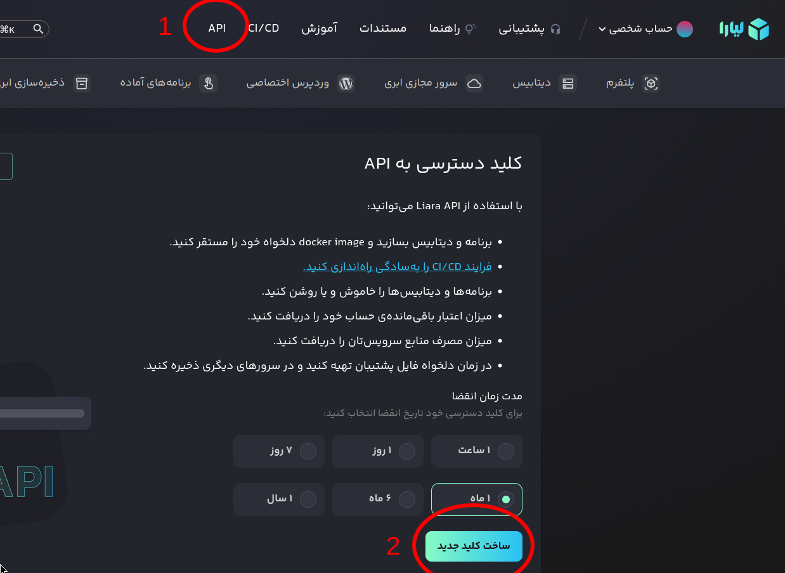

Liara for [`libdns`](https://github.com/libdns/libdns)
=======================

This package implements the [libdns interfaces](https://github.com/libdns/libdns) for Liara, allowing you to manage DNS records.

## How to configure

Simply, go to the Liara's console and obtain your API Key from the top header.

